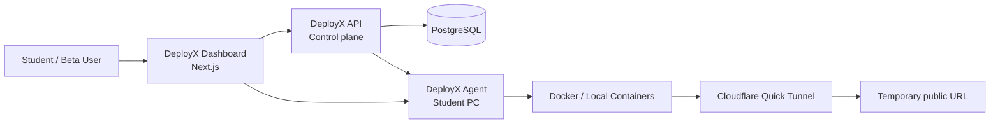

# DeployX Architecture

DeployX is built as a small control-plane + local-runtime architecture. The dashboard and API coordinate deployments, while the DeployX Agent runs on the student PC and owns the actual project build and runtime lifecycle.

## High-level overview

## Components

### Dashboard
- User-facing web app for authentication, project upload, deployment status, logs, and pairing.
- Intended for browser access from a student machine.
- Does not execute project code.

### API
- Central control plane.
- Stores user, project, deployment, and agent metadata.
- Tracks pairing state, health checks, and deployment events.
- Exposes safe operational endpoints such as `/health`, `/agent/health`, and project controls.

### PostgreSQL
- Stores persistent metadata and deployment records.
- Migrations and schema are managed through Prisma or the repository's chosen database workflow.

### DeployX Agent
- Runs locally on the student PC.
- Detects Docker availability and environment state.
- Receives pairing codes and manages local project build operations.
- Owns runtime lifecycle, logs, and cleanup.

### Docker runtime
- Each project runs in an isolated local container.
- Builds and runtime execution remain inside the student's machine.
- Docker is required for the local deployment flow.

### Cloudflare Quick Tunnel
- Used only to expose a temporary public URL for the running app.
- The project remains local; the tunnel only exposes the public endpoint.

## Execution model

The important boundary is:

- The DeployX cloud API is the control plane.
- The student PC is the runtime plane.

Student project code executes on the student's computer. The cloud layer does not run project sources or build artifacts.

## Deployment flow

1. User signs in to the dashboard.
2. Student installs and pairs the DeployX Agent.
3. Dashboard sends a deployment request to the API.
4. API validates the request and references the paired local agent.
5. Agent builds the project locally in Docker.
6. Agent waits for the app to become healthy.
7. Agent starts or reuses a Quick Tunnel for the temporary public URL.
8. Dashboard shows status and logs while the project remains running on the student computer.

## Limitations

- Temporary public URLs are not permanent hosting.
- The agent must remain online while the deployment is active.
- If the student's PC is off or disconnected, the deployment is unavailable.
- Docker is a requirement for the local runtime workflow.
- The public URL is temporary and should not be considered a production hosting solution.

## Security boundary

The project runtime and the control plane are intentionally separated. The API coordinates, but does not become the execution environment for user code. That boundary keeps the cloud service simpler and reduces multi-user execution risk.
